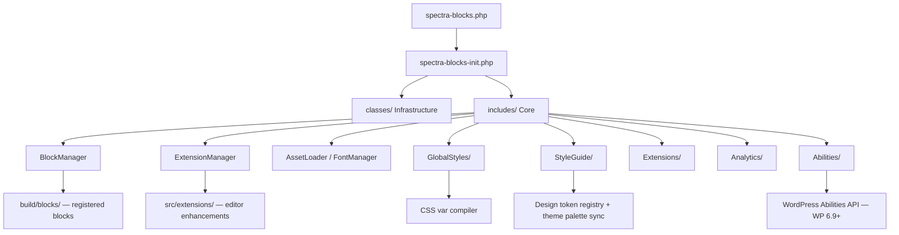
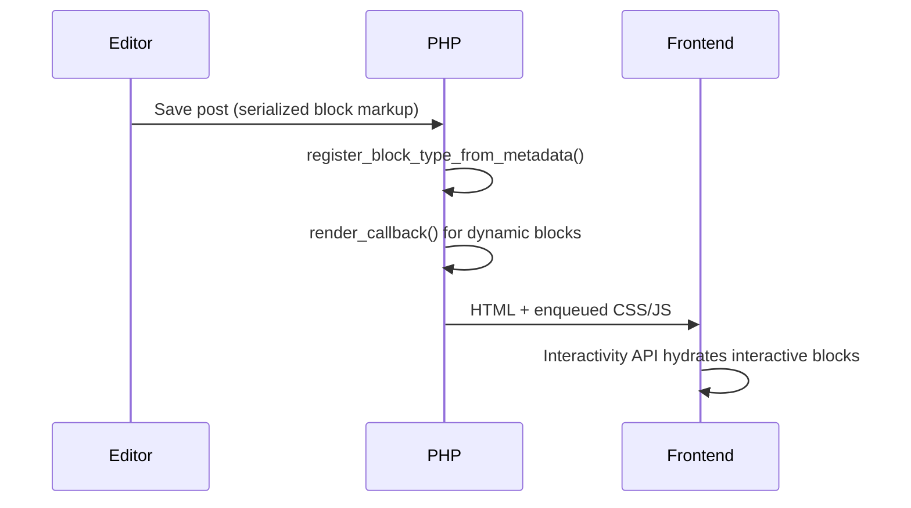

# Spectra Blocks — Architecture

## Introduction

Spectra Blocks is a standalone WordPress Gutenberg block plugin (45+ blocks, `spectra/` namespace) built on the WordPress Interactivity API. It is the free plugin that Spectra Blocks Pro extends.

## System Architecture



## Class Tier Split

Two PHP tiers with different patterns:

| Tier | Path | Pattern | Purpose |
|------|------|---------|---------|
| Infrastructure | `classes/Spectra_Blocks_*` | Static `::init()` | Bootstrap, WP hooks, option wrappers |
| Core | `includes/Spectra\*` | `Singleton` trait, PSR-4 | Domain logic |

## Block Architecture

```
src/blocks/{name}/           ← Editor (JS/SCSS source)
  block.json                   Attributes, supports, categories
  edit.js                      Editor React component
  settings.js                  Inspector controls
  render.js / save.js          Frontend output (null for dynamic blocks)
  style.scss / editor.scss     Styles

includes/Blocks/{Name}.php   ← PHP render callback (dynamic blocks only)
build/blocks/{name}/         ← Compiled output (never edit directly)
```

Registration: `register_block_type_from_metadata()` from `build/blocks/*/block.json`.

**PHP files in `src/blocks/*/controller.php`** are copied to `build/` at build time — edits require a rebuild.

## Extension Architecture

Cross-block editor enhancements. Each extension follows a dual-layer pattern:

- **JS:** `src/extensions/{name}/index.js` — `addFilter('editor.BlockEdit', ...)` injects controls into every block's inspector
- **PHP:** `includes/Extensions/{Name}.php` — `render_block` or `wp_head` filter applies the extension's server-side output

## Global Styles & Style Guide

`includes/GlobalStyles/` — JIT CSS variable compiler. Reads saved design tokens and generates scoped `--spectra-*` CSS custom properties, enqueued on the frontend.

`includes/StyleGuide/` — Design token registry and palette sync. Injects active palette colors into the theme layer via the `wp_theme_json_data_theme` filter. Key classes: `ColorModel` (semantic token map), `TokenRegistry` (slug/label formatting), and per-theme bridges (Astra, SpectraOne).

## Abilities (WP 6.9+)

`includes/Abilities/` — 50+ ability classes exposing block operations to the WordPress Abilities API (and MCP). Each class extends `AbstractAbility`. See [`includes/Abilities/CLAUDE.md`](includes/Abilities/CLAUDE.md) for the contract and conventions.

## Admin Dashboard

`admin/` — React SPA at `wp-admin/admin.php?page=spectra-blocks`.
- REST namespace: `spectra-blocks/v1`
- Separate build: `cd admin && npm run build`
- Mount point: `<div id="spectra-blocks-dashboard-app">`

## Shared Libraries (`lib/`)

Managed by Composer as private BSF VCS repos:

| Library | Purpose |
|---------|---------|
| `bsf-analytics` | Analytics opt-in UI |
| `zip-ai` | Zip AI assistant integration |
| `astra-notices` | Admin notices |
| `nps-survey` | NPS survey |
| `zipwp-images` | ZipWP image picker |

## Build Pipeline

| Source | Tool | Output |
|--------|------|--------|
| `src/` JS/SCSS | `@wordpress/scripts` (webpack) | `build/` |
| `src/blocks/*/controller.php` | Copied by webpack | `build/blocks/*/controller.php` |
| `admin/src/` | Separate webpack | `admin/build/` |

## Data Flow — Block Render


