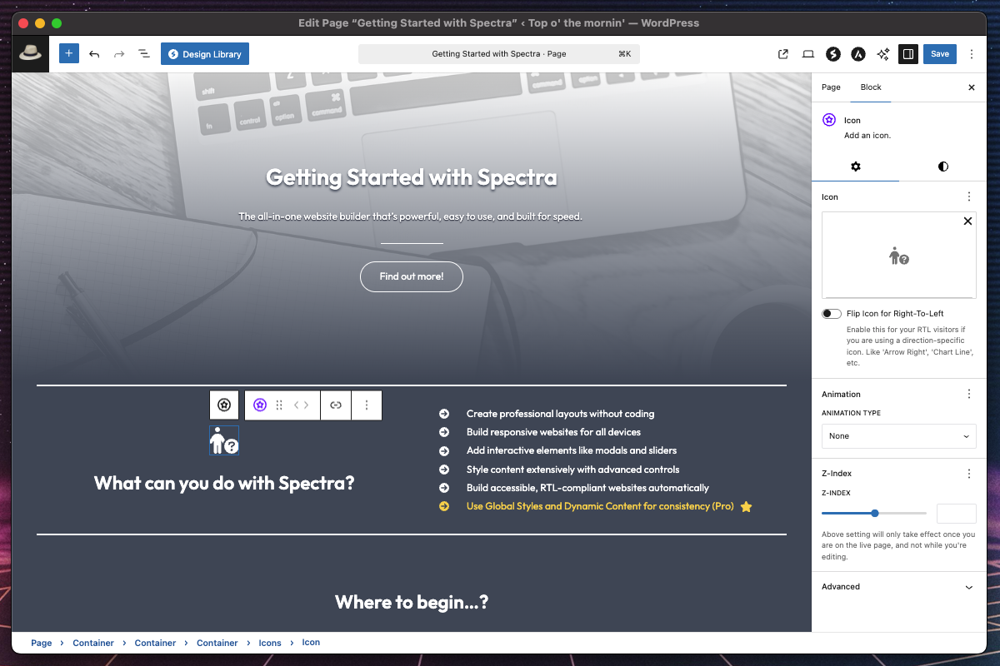
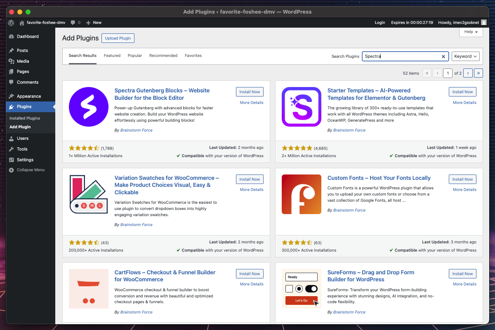
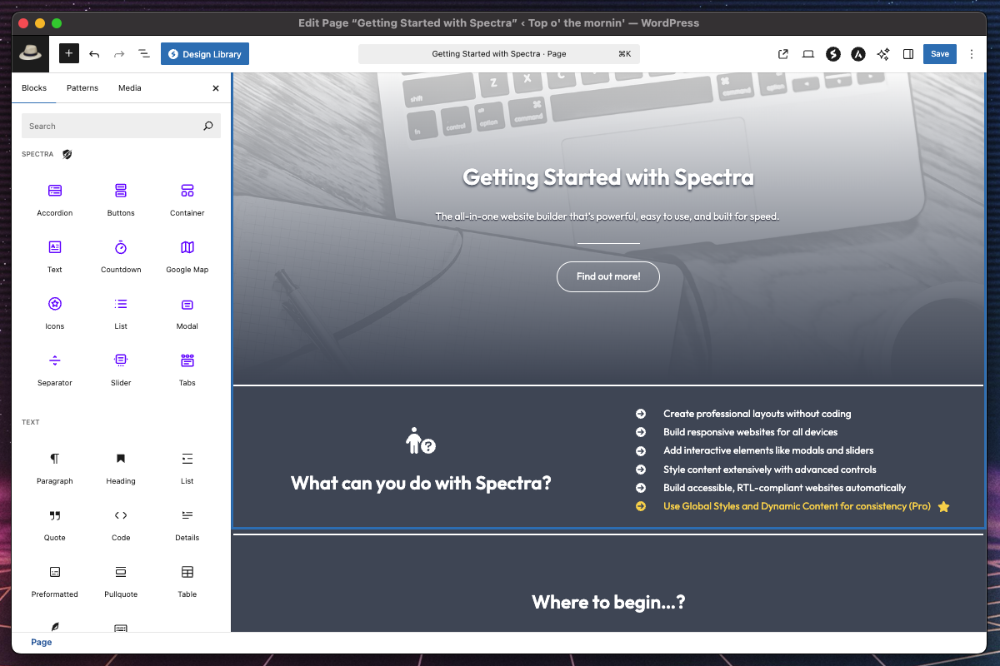
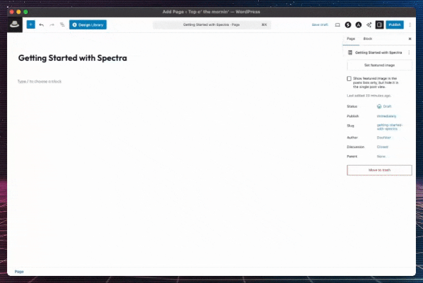
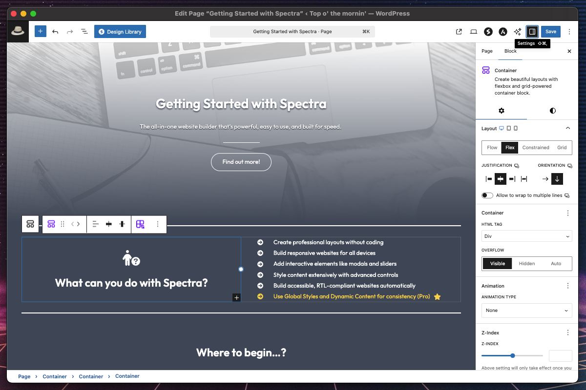
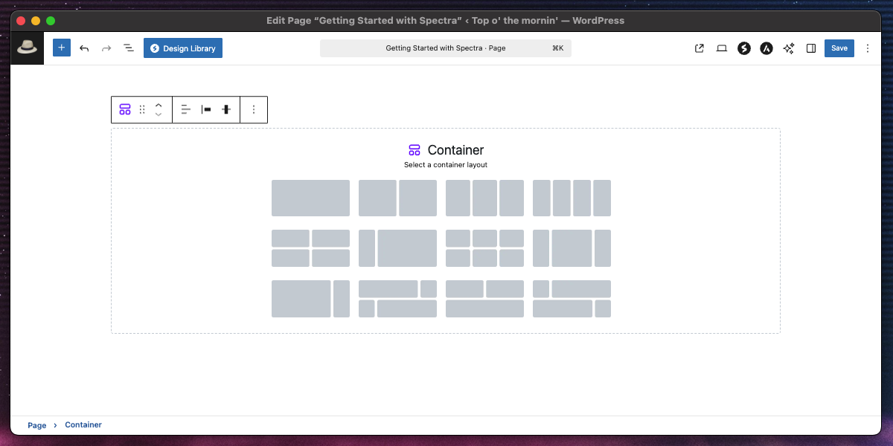
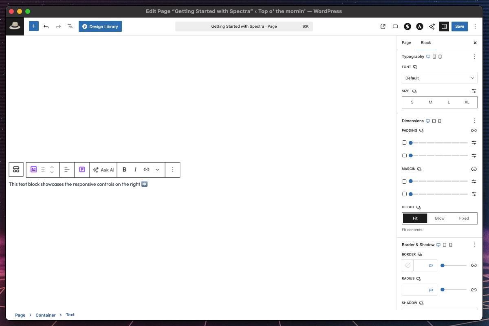
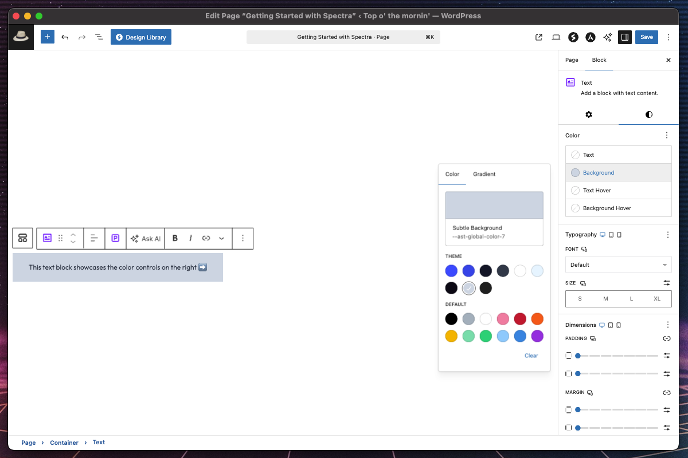

# Getting Started with Spectra

## Introduction

Spectra is a powerful WordPress Gutenberg block plugin that transforms your content creation experience with professional-grade blocks and advanced styling capabilities. Designed for WordPress 6.6+ and built with modern development standards, Spectra provides everything you need to create stunning, responsive websites without any coding knowledge.

**What makes Spectra special:**
- **12+ Professional Blocks**: From basic content to complex layouts and interactive elements
- **Advanced Styling Controls**: Typography, colors, animations, borders, shadows, and more
- **Responsive Design**: Built-in controls for desktop, tablet, and mobile devices
- **RTL Language Support**: Full Right-to-Left language support for Arabic, Hebrew, Persian, Urdu, and other RTL languages
- **Performance Optimized**: Fast loading with modern React architecture
- **Accessibility First**: WCAG compliant blocks with semantic HTML
- **Developer Friendly**: Extensible architecture with hooks and filters
- **SEO Ready**: Semantic HTML structure optimized for search engines

## Installation and Setup

### Method 1: WordPress Admin Dashboard (Recommended)

**Install from WordPress Repository**
- Log into your WordPress admin dashboard
- Navigate to **Plugins → Add New**
- Search for "Ultimate Addons for Gutenberg" or "Spectra"
- Click **Install Now** on the Spectra plugin
- Click **Activate** once installation completes

### Method 2: Manual Installation

**Download and Upload**
- Download the plugin zip file from WordPress.org
- Go to **Plugins → Add New → Upload Plugin**
- Choose the zip file and click **Install Now**
- Activate the plugin

## System Requirements

### Minimum Requirements

| Component | Requirement |
|-----------|------------|
| **WordPress** | 6.6.0 or higher |
| **PHP** | 8.1 or higher |
| **Browser** | Modern browsers (Chrome, Firefox, Safari, Edge) |
| **JavaScript** | Enabled (required for block editor) |

### Recommended Setup

- **WordPress**: Latest version
- **PHP**: 8.2 or higher
- **Memory**: 256MB or higher
- **Theme**: Compatible with all themes, but works best with Astra
- **Caching**: Compatible with all major caching plugins

## Your First Steps with Spectra

### Step 1: Exploring the Block Library

1. **Open the Block Inserter**
   - Create a new page or edit an existing one
   - Click the **"+"** button to open the block inserter
   - Look for the **"Spectra"** category

2. **Available Block Categories**
   - **Layout Blocks**: Container (with multiple variations)
   - **Content Blocks**: Text, Buttons, Icons, Separator
   - **Interactive Blocks**: Accordion, Tabs, Slider, Modal
   - **Media Blocks**: Countdown, List, Google Map

### Step 2: Creating Your First Layout

**Let's create a simple hero section:**

1. **Add a Container Block**
   - Search for "Container" in the block inserter
   - Select the **Container Block** from Spectra
   - Choose a layout variation (we'll use "One Column")

2. **Customize the Container**
   - Set a background image or gradient
   - Adjust padding for spacing
   - Set minimum height (e.g., 400px)

3. **Add Content Inside**
   - Click inside the container
   - Add a **Text Block** for your headline
   - Add a **Buttons Block** for call-to-action

### Step 3: Understanding Block Settings

**Spectra blocks include:**

1. **General Settings**
   - Block-specific options (text, links, content)
   - Layout and behavior controls

2. **Style Settings**
   - **Colors**: Text, background, hover states
   - **Typography**: Font family, size, weight, spacing
   - **Dimensions**: Padding, margin, width, height
   - **Border & Shadow**: Complete styling control

3. **Advanced Settings**
   - Custom CSS classes
   - Anchor IDs
   - Animation settings (via extension)

## Essential Blocks Overview

### Layout Foundation: Container Block

**Purpose**: Creates sections and layouts with advanced styling options

**Key Features:**
- 12 pre-built layout variations
- Background media support (image/video)
- Responsive controls
- Semantic HTML options
- Automatic layout direction adaptation for Right-to-Left languages

**RTL Support Features:**
- Automatic container direction switching (LTR/RTL)
- RTL-aware child element alignment and positioning
- Smart column ordering for multi-column layouts in RTL
- RTL-compatible spacing and padding adjustments

**Common Use Cases:**
- Hero sections
- Content sections
- Multi-column layouts
- Page structures
- RTL language website layouts

### Content Creation: Text Block

**Purpose**: Enhanced text block with advanced typography and effects

**Key Features:**
- Complete typography control
- Text shadows and hover effects
- Drop cap support
- Dynamic content integration (Pro)
- Automatic text direction detection and manual controls for Right-to-Left languages (Arabic, Hebrew, Persian, Urdu, etc.)

**RTL Support Features:**
- Automatic text direction based on content language
- Manual text direction override (LTR/RTL/Auto)
- RTL-aware text alignment (right-aligned by default for RTL text)
- Proper handling of mixed-direction content (bidirectional text)
- RTL-compatible typography spacing and margins

**Common Use Cases:**
- Headlines and subheadings
- Body text with styling
- Feature descriptions
- Call-to-action text
- Multilingual content with RTL languages

### Interactive Elements: Buttons Block

**Purpose**: Professional call-to-action buttons with extensive customization

**Key Features:**
- Multiple button support
- Icon integration
- Hover effects
- Responsive layouts
- Automatic button alignment and icon positioning for Right-to-Left languages

**RTL Support Features:**
- RTL-aware button group alignment and spacing
- Toggleable icon mirroring and positioning within buttons
- RTL-compatible button text alignment
- Smart button ordering in button groups for RTL layouts
- Proper icon-text relationship in RTL button content

**Common Use Cases:**
- Hero section CTAs
- Navigation buttons
- Download links
- Social media links
- RTL language call-to-action elements

### Visual Enhancement: Icon & Icons Blocks

**Purpose**: Font Awesome icons with styling and layout options

**Key Features:**
- Hundreds of icons available
- Hover effects and animations
- Grouping and layout controls
- Link functionality
- Toggleable icon mirroring and positioning for Right-to-Left layouts

**RTL Support Features:**
- Toggleable icon mirroring for directional icons (arrows, chevrons, etc.)
- RTL-aware icon alignment and positioning
- Smart icon spacing that adapts to text direction
- RTL-compatible icon group layouts (Icons Block)
- Proper icon-text relationship in mixed-direction content

**Common Use Cases:**
- Feature lists
- Social media links
- Navigation elements
- Visual enhancements
- RTL language interface elements

### Interactive Modals: Modal Block

**Purpose**: Create interactive popup overlays for content, images, or forms

**Key Features:**
- Customizable trigger buttons
- Flexible popup content areas
- Close button with styling options
- Background overlay controls
- Animation and transition effects

**Common Use Cases:**
- Image lightboxes
- Contact forms
- Newsletter signups
- Product information
- Terms and conditions

### Content Division: Separator Block

**Purpose**: Create stylized dividers and visual breaks between content sections

**Key Features:**
- Multiple separator styles (line, decorative, custom SVG)
- Width and height controls
- Color and gradient support
- Responsive spacing options
- Custom alignment

**Common Use Cases:**
- Section dividers
- Visual content breaks
- Decorative elements
- Page structure organization

### Location Display: Google Map Block

**Purpose**: Embed interactive Google Maps with customization options

**Key Features:**
- Address-based or coordinate-based mapping
- Custom map styling and controls
- Marker customization
- Zoom and interaction controls
- Responsive map sizing

**Common Use Cases:**
- Business locations
- Event venues
- Contact pages
- Store locators
- Service area displays

## Working with Responsive Design

### Device-Specific Controls

**Spectra blocks include responsive controls for:**
- Typography (font size, line height, letter spacing)
- Spacing (padding, margin, gap)
- Dimensions (width, height, min/max values)
- Layout (alignment, direction, wrap)

### Using Responsive Controls

1. **Identify Responsive Settings**
   - Look for device icons next to controls
   - Icons show: Desktop, Tablet, Mobile

2. **Switch Between Devices**
   - Click device icons to change view
   - Settings apply only to selected device
   - Editor preview updates accordingly

3. **Inheritance System**
   - Mobile inherits from Tablet
   - Tablet inherits from Desktop
   - Override only where needed

### Best Practices

- **Mobile-First Approach**: Start with mobile settings
- **Test on Real Devices**: Use responsive mode as a guide
- **Keep It Simple**: Don't over-customize each breakpoint
- **Content Priority**: Hide non-essential elements on mobile

## Styling and Customization

### Color System

**Spectra integrates with WordPress color system:**
- **Theme Colors**: Uses your active theme's color palette
- **Custom Colors**: Full color picker with opacity control
- **Gradients**: Linear and radial gradient support
- **Hover States**: Separate colors for interactive elements

### Typography Controls

**Advanced typography options include:**
- **Font Family**: System fonts + Google Fonts integration
- **Font Size**: Multiple units (px, em, rem, %, vw)
- **Font Weight**: 100-900 weight options
- **Line Height**: Precise line spacing control
- **Letter Spacing**: Character spacing adjustment
- **Text Transform**: Case transformations

### Spacing and Layout

**Precise control over:**
- **Padding**: Internal spacing (responsive)
- **Margin**: External spacing (responsive)
- **Gap**: Space between child elements
- **Width/Height**: Dimension controls
- **Min/Max Values**: Constraint controls

### Advanced Effects

**Visual enhancements:**
- **Borders**: Width, style, color, radius
- **Box Shadows**: Multiple shadow layers
- **Text Shadows**: Depth and emphasis effects
- **Hover Effects**: Interactive state changes
- **Animations**: Entrance effects (via extension)

## Extensions and Features

### Animation Extension (Built-in)

**Add movement to your content:**

**Available Animations (25+ effects):**
- **Fade**: Standard, Up, Down, Left, Right
- **Slide**: Up, Down, Left, Right
- **Zoom**: In, Out, with directional variants
- **Flip**: Up, Down, Left, Right

**Animation Controls:**
- **Duration**: Animation speed (100-3000ms)
- **Delay**: Start delay (0-3000ms)
- **Easing**: Animation curve options
- **Trigger**: Scroll-based activation

### Responsive Controls Extension (Built-in)

**Device-specific customization for:**
- All typography settings
- Spacing and dimensions
- Layout and alignment
- Border and styling properties

### Image Mask Extension (Built-in)

**Add creative shapes to images:**
- Apply SVG masks to the WordPress Image block
- Multiple built-in shape options (circle, blob, diamond, etc.)
- Custom mask support

### Z-Index Extension (Built-in)

**Manage layer stacking:**
- Control element layering and overlap
- Prevent content conflicts
- Ensure proper display hierarchy

### Dynamic Content Extension (Pro)

**Connect your blocks to live data:**
- Post/page content and meta
- User information
- Custom fields (ACF supported)
- Site-wide data
- URL parameters

## Performance and Optimization

### Built-in Performance Features

**Spectra is optimized for speed:**
- **Modern Architecture**: React-based with efficient rendering
- **Selective Loading**: Only loads styles for blocks in use
- **Minimal DOM**: Clean HTML output
- **CSS Variables**: Dynamic styling without inline CSS

### Best Practices for Performance

1. **Limit Block Usage**
   - Use only necessary blocks
   - Combine related content in single blocks
   - Avoid excessive nesting

2. **Image Optimization**
   - Compress images before upload
   - Use appropriate file formats (WebP when possible)
   - Set proper image dimensions

3. **Animation Considerations**
   - Use animations sparingly
   - Test on mobile devices
   - Consider user preferences (prefers-reduced-motion)

## Accessibility Features

### Built-in Accessibility

**Spectra blocks follow WCAG 2.1 guidelines:**

**Semantic HTML:**
- Proper heading hierarchy
- ARIA attributes where needed
- Semantic element usage

**Keyboard Navigation:**
- Full keyboard accessibility
- Logical tab order
- Visible focus indicators
- Keyboard shortcuts support

**Screen Reader Support:**
- Descriptive alternative text
- ARIA live regions for dynamic content
- Proper label associations

**Color and Contrast:**
- Color-independent information
- Sufficient contrast ratios
- Customizable color schemes

**RTL Language Support:**
- Automatic text direction detection and switching
- RTL-aware layout and element positioning
- Proper reading order for screen readers in RTL languages
- Bidirectional text support for mixed-language content

### Accessibility Best Practices

1. **Content Structure**
   - Use headings (H1-H6) in logical order
   - Don't skip heading levels
   - Use semantic HTML elements with the Container and Text blocks

2. **Images and Media**
   - Always add alt text to images or icons rendered as images
   - Use descriptive captions
   - Provide transcripts for videos

3. **Interactive Elements**
   - Make clickable areas large enough (44x44px minimum)
   - Use descriptive link text
   - Provide keyboard alternatives

4. **Color and Typography**
   - Maintain 4.5:1 contrast ratio for normal text
   - Use 3:1 ratio for large text (18pt+ or 14pt+ bold)
   - Ensure text remains readable when zoomed to 200%

5. **RTL Language Considerations**
   - Test your content with RTL languages to ensure proper layout
   - Verify that text direction switching works correctly
   - Ensure icons and visual elements mirror appropriately for RTL
   - Check that navigation and interactive elements follow RTL reading patterns

## Troubleshooting Common Issues

### Installation Issues

**Plugin won't activate?**
- Check PHP version (8.1+ required)
- Verify WordPress version (6.6+ required)
- Ensure sufficient memory (256MB recommended)
- Check for plugin conflicts

**Blocks not appearing?**
- Clear browser cache
- Deactivate other block plugins temporarily
- Check for JavaScript errors in browser console
- Try switching to a default theme

### Styling Issues

**Styles not displaying correctly?**
- Clear any caching plugins
- Check theme compatibility
- Verify no CSS conflicts
- Test with default theme

**Responsive controls not working?**
- Ensure you're viewing the correct device breakpoint
- Clear cache and test on actual devices
- Check for theme CSS overrides

### Performance Issues

**Site loading slowly after adding blocks?**
- Optimize images and media
- Limit the number of Google Fonts
- Use caching plugins appropriately
- Check for plugin conflicts

## Next Steps

### Recommended Learning Path

1. **Week 1: Basics**
   - Install and activate Spectra
   - Create your first page with Container and Text blocks
   - Experiment with styling options
   - Practice responsive design

2. **Week 2: Advanced Features**
   - Learn all available blocks
   - Create complex layouts
   - Add animations and interactions
   - Optimize for mobile devices

3. **Week 3: Integration**
   - Integrate with your existing theme
   - Create reusable block patterns
   - Optimize for performance
   - Test accessibility compliance

4. **Week 4: Mastery**
   - Create custom designs
   - Explore Pro features (if applicable)
   - Build client projects
   - Contribute to the community

### Project Ideas to Practice

1. **Business Homepage**
   - Hero section with Container and Buttons
   - Features section with Icons and Text
   - Testimonials with Slider and custom styling

2. **Landing Page**
   - Countdown timer for offers
   - Multiple call-to-action buttons
   - Accordion FAQ section

3. **Portfolio Site**
   - Image galleries with sliders
   - Project descriptions with tabs
   - Contact information with icons

4. **Documentation Site**
   - Nested content with accordions
   - Code examples with Text blocks
   - Navigation with button groups

## Frequently Asked Questions

### General Questions

**Q: Is Spectra free to use?**
A: Yes, Spectra includes 12+ professional blocks and core features completely free. Spectra Pro adds advanced blocks, extensions, features and priority support.

**Q: Does Spectra work with my theme?**
A: Spectra works with all standard WordPress themes. But with [Astra being among the first ones to be Gutenberg ready](https://wpastra.com/gutenberg-compatible/?utm_source=wp-spectra&utm_medium=uagb&utm_campaign=getting-started), we recommend you to try using Astra since it is lightweight, fast, simple and comes with a lot of options.

**Q: Can I use Spectra with other page builders?**
A: Spectra is designed for the WordPress block editor (Gutenberg). It won't interfere with other page builders, and can works alongside other Gutenberg block-based tools.

**Q: Will my content be lost if I deactivate Spectra?**
A: When deactivating Spectra, all Spectra blocks will not render - but the configurations will persist. Re-activating Spectra will restore all your Spectra blocks back to how they were configured on your pages.

### Technical Questions

**Q: What browsers does Spectra support?**
A: All modern browsers including Chrome, Firefox, Safari, and Edge (latest 2 versions).

**Q: Does Spectra affect SEO?**
A: Positively! Spectra uses semantic HTML and follows SEO best practices.

**Q: Is Spectra GDPR compliant?**
A: Yes, Spectra doesn't collect personal data and respects user privacy.

**Q: Can I customize the block appearance?**
A: Absolutely! Extensive styling controls plus custom CSS options.

### Troubleshooting

**Q: Why aren't my changes showing on the frontend?**
A: Clear your browser cache and any caching plugins. Check for theme CSS conflicts.

**Q: The block editor feels slow with Spectra?**
A: Ensure you're using the latest WordPress version and check for plugin conflicts.

**Q: Can I export/import Spectra blocks?**
A: Yes, use WordPress export/import tools or block pattern functionality.

## Conclusion

Spectra transforms the WordPress editing experience with professional-grade blocks and advanced styling capabilities. Whether you're a beginner creating your first website or a professional developer building for clients, Spectra provides the tools you need to create beautiful, accessible, and performant websites.

**Key takeaways:**
- Start with basic blocks and build complexity gradually
- Always consider mobile users and accessibility
- Use responsive controls to optimize for all devices
- Leverage animations and interactions to enhance user experience
- Follow performance best practices for fast-loading sites

**Ready to get started?**
1. Install Spectra from the WordPress plugin repository
2. Create your first page with Container and Text blocks
3. Explore styling options and responsive controls
4. Join the community and [share your creations](https://wpspectra.com/showcase/)

Welcome to the future of WordPress block editing with Spectra!

## Additional Resources

### Block-Specific Documentation

For detailed information about individual blocks, see:
- [Container Block](./blocks/container/container.md) - Advanced layout foundation
- [Buttons Block](./blocks/buttons/buttons.md) - Professional call-to-action buttons
- [Icon Block](./blocks/icon/icon.md) - Font Awesome icons with styling
- [List Block](./blocks/list/list.md) - Enhanced lists with icons
- [Modal Block](./blocks/modal/modal.md) - Interactive popup modals
- [Separator Block](./blocks/separator/separator.md) - Stylized content dividers
- [Slider Block](./blocks/slider/slider.md) - Image and content sliders
- [Tabs Block](./blocks/tabs/tabs.md) - Tabbed content organization

### Extension Documentation

- [Animation Extension](./extensions/animations/animations.md) - Motion effects for blocks
- [Image Mask Extension](./extensions/image-mask/image-mask.md) - Creative shape masks for images

---

*This documentation is part of Spectra 3.0.0 and is updated regularly. For the latest information, visit [wpspectra.com](https://wpspectra.com).*